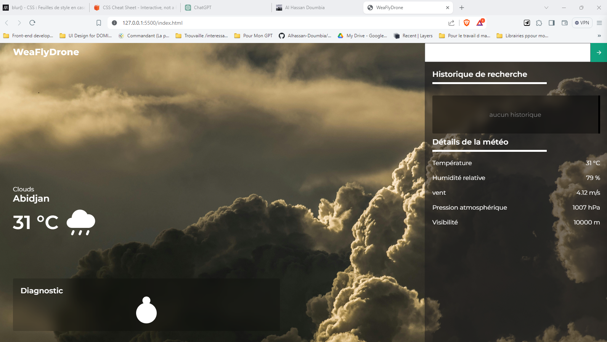
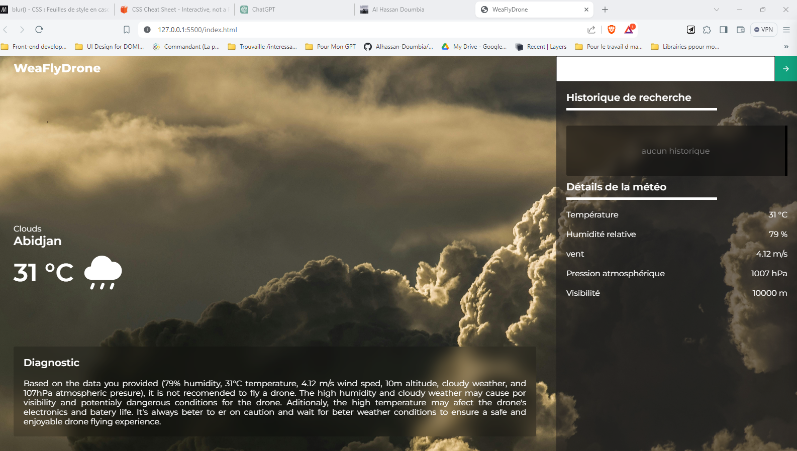

# WeaFlyDrone

WeaFlyDrone est une application Web permettant d'assister les pilotes de drone dans la décision de faire voler leur drone ou non dans une localité précise, en se basant sur des données météorologiques obtenues en temps réel. L'application prend en compte à la fois les conditions météorologiques globales par rapport à une localité donnée et met l'accent sur les données importantes pour le pilote telles que la température, la direction du vent, la vitesse du vent et la pression atmosphérique. Grâce à ces différentes métriques, notre algorithme établit une interprétation de la situation et affiche à l'utilisateur s'il est idéal pour voler ou non.

## Fonctionnalités principales

- Assistance à la décision pour les pilotes de drone en se basant sur les données météorologiques en temps réel.
- Prise en compte des conditions météorologiques globales et locales.
- Affichage des conditions météorologiques pertinentes pour le vol de drone.

## Captures d'écran

## Technologies utilisées

- HTML5
- SASS
- Javascript
- GPT3 API
- OpenWeatherMap API

## Auteur

- Doumbia Al hassan Ahmed - Caps. let's discuss via my social media : https://bento.me/al-hassan-doumbia
